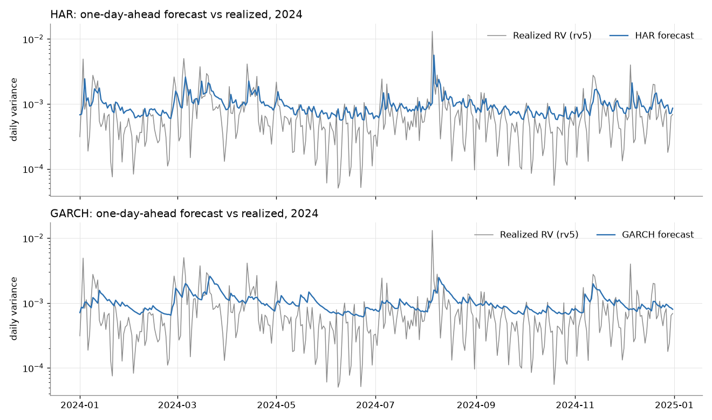

# realized-vol-forecasting
Daily realized volatility forecasting on crypto from 5-minute returns: naive, EWMA, GARCH(1,1), HAR-RV and one ML model, walk-forward evaluation with QLIKE, MSE and Diebold-Mariano tests.

## Reproduce

```bash
pip install -r requirements.txt            # + requirements-notebook.txt for plots / notebook
python scripts/download.py                 # BTCUSDT spot 1m klines 2018-01..2026-08 -> data/raw/ (SHA-256 checked, git-ignored)
python scripts/build_rv.py                 # -> data/derived/btcusdt_rv5_daily.csv (+ btcusdt_rv5_excluded_days.csv)
python scripts/run_baselines.py            # -> results/forecasts.csv, results/summary.json
python scripts/run_ml.py --model MLP-QLIKE     # -> results/forecasts_MLP-QLIKE.csv
python scripts/run_ml.py --model Linear-QLIKE  # -> results/forecasts_Linear-QLIKE.csv
python scripts/evaluate.py                 # -> metrics, DM tests, MSE concentration, seed QLIKE, verdict
python scripts/plot_2024.py                # -> results/forecast_vs_realized_2024.png
python scripts/update_readme_results.py    # copies results/ tables into this README
pytest
```

## Data

`data/derived/btcusdt_rv5_daily.csv`, one row per UTC day from 2018-01-01 to 2026-08-31:

| column | definition |
|---|---|
| `date` | UTC day |
| `rv5` | sum of squared 5-min log returns on a fixed UTC grid (price at grid point t = close of the 1m bar opened at t - 1 min), no forward fill |
| `n_obs` | number of valid 5-min returns (max 288) |
| `n_missing` | missing 1m bars out of 1440 |
| `flag` | `n_missing > 72` (more than 5 % missing) |
| `ret` | close-to-close log return of the UTC day: close of the bar opened at D 23:59 vs the same bar of D-1; NaN if either bar is missing (no forward fill) |

Conventions are documented at the top of `scripts/build_rv.py`.

### Off-grid bars in 2018-02

`BTCUSDT-1m-2018-02.zip` contains 1201 contiguous 1m bars whose open time is offset by +14.789 s
from the minute grid, from 2018-02-09 09:59:14.789 to 2018-02-10 05:59:14.789 UTC. They are
dropped, not snapped to the minute, and counted as missing minutes. Impact: one day changes status.
2018-02-10 is flagged with 375 missing minutes; with snapping it would have 15 and would not be
flagged. 2018-02-09 is flagged under both choices.

## Flagged-day policy

- **Explanatory variable**: `rv_adj = rv5 * 1440 / (1440 - n_missing)`; `rv_adj = NaN` when
  `n_missing = 1440`. A forecast whose explanatory-variable window contains a NaN is marked not
  evaluable.
- **Target**: `rv5` of day t+1. Flagged target days are excluded from the loss computation,
  identically for every model. Losses are computed on the days evaluable for all models.
- **Return-based models (EWMA, GARCH)**: a variance recursion cannot run through a missing
  return, so they use the longest NaN-free run of `ret` ending at t. Missing returns are
  2018-01-01, 2018-02-08, 2018-02-09 and 2018-02-10, so this run starts on 2018-02-11 for every
  out-of-sample origin. If `ret(t)` is NaN the forecast is not evaluable.

## Walk-forward protocol (`src/walkforward.py`)

- One-day-ahead: at the end of day t, forecast the RV of day t+1 using only rows with date <= t.
  The engine hands each model a copy of `df.loc[:t]`; `predict` refuses any target date that is
  not exactly t+1.
- Out-of-sample target days: 2020-01-01 to 2026-08-31, expanding window.
- Each model exposes `fit(data <= t)` and `predict(t+1)` (`src/models.py`).

| model | specification |
|---|---|
| Naive | `RV_hat(t+1) = rv_adj(t)` |
| EWMA | RiskMetrics on squared daily returns, lambda = 0.94 fixed; `s2(t+1) = 0.94 s2(t) + 0.06 ret(t)^2`, started at `ret^2` of the first day of the NaN-free run |
| GARCH | GARCH(1,1), constant mean, normal errors (`arch`), returns x100; parameters re-estimated on the first origin and every 22 origins; conditional variance filtered daily with the latest parameters on data <= t; minimum 250 returns |
| HAR | HAR-RV in levels (Corsi 2009) by OLS, re-estimated daily: `RV(t+1) = b0 + bd RV(t) + bw mean(RV t-4..t) + bm mean(RV t-21..t)`; regressors use `rv_adj`, left-hand side is `rv5` with flagged target days dropped; forecasts <= 0 are floored at 1e-8 and counted |

### QLIKE-trained models (`src/ml.py`, PyTorch on CPU)

| model | specification |
|---|---|
| MLP-QLIKE | 12 inputs, 2 hidden layers of 32 units with ReLU, output `log h(t+1)` |
| Linear-QLIKE | same inputs, loss and protocol, no hidden layer (control: isolates the non-linearity from the loss) |

- Inputs at origin t, computed on `rv_adj`: `log RV_d`, `log RV_w` (mean of 5 days), `log RV_m`
  (mean of 22 days), `r_t`, `min(r_t, 0)`, day of week of t+1 (one-hot, 7 columns).
- Standardization with the mean and standard deviation of the training window of the current
  refit only, recomputed at every refit.
- Loss: `mean(RV exp(-out) + out - log RV - 1)` with `RV = rv5(t+1)`; training rows with a flagged
  target day are dropped (same rule as HAR).
- Adam, lr 1e-3, full batch (no shuffling), early stopping on the last 10 % of the training rows
  in chronological order (patience 100 epochs, best weights restored), maximum 20000 epochs,
  output bias initialized at `log(mean RV)` of the fitting rows.
- Refit every 22 origins, expanding window. Seeds 0 to 4; the forecast is the mean of the five
  seeds' `h`. One CPU thread and deterministic algorithms: a re-run gives identical forecasts.
- Hyperparameters are fixed and were not tuned on the out-of-sample period. The only value set
  from data is the epoch cap: with a cap of 5000 the linear control did not stop on the refit at
  origin 2019-12-31 (its early-stopping rows are 2019-10-23 to 2019-12-30); without a cap it
  stopped between epochs 7143 and 7582, so the cap was set to 20000.

### Decision rule

MLP-QLIKE is declared better only if it beats HAR **and** Linear-QLIKE on QLIKE with p < 0.05
(Diebold-Mariano statistic < 0). Otherwise the result is reported as negative.

Metrics: `MSE = mean((RV - h)^2)`, `QLIKE = mean(RV/h - log(RV/h) - 1)`.
Evaluation days: the days evaluable for all session-2 models (the `evaluable` column of
`results/forecasts.csv`); the QLIKE-trained models are evaluated on the same days.
Diebold-Mariano for QLIKE and MSE: Naive, EWMA, GARCH, MLP-QLIKE and Linear-QLIKE against HAR,
and MLP-QLIKE against Linear-QLIKE; `d = loss(model) - loss(benchmark)`,
Newey-West (Bartlett) HAC variance with lag `floor(4 (T/100)^(2/9))`, two-sided normal p-value,
`sign` = sign of the statistic.

## Results

<!-- results:start -->
`results/metrics.csv`

| model | N | MSE | QLIKE |
|---|---|---|---|
| Naive | 2423 | 1.262669e-05 | 4.836047e-01 |
| EWMA | 2423 | 9.070281e-06 | 4.269562e-01 |
| GARCH | 2423 | 8.465005e-06 | 4.220103e-01 |
| HAR | 2423 | 1.458162e-05 | 3.763463e-01 |
| MLP-QLIKE | 2423 | 1.746373e-05 | 2.887384e-01 |
| Linear-QLIKE | 2423 | 4.444917e-05 | 2.860165e-01 |

`results/dm_tests.csv` (d = loss(model) - loss(benchmark))

| model | benchmark | loss | T | nw_lag | mean_d | dm_stat | p_value | sign |
|---|---|---|---|---|---|---|---|---|
| Naive | HAR | MSE | 2423 | 8 | -1.95493e-06 | -0.506445 | 0.612544 | -1 |
| EWMA | HAR | MSE | 2423 | 8 | -5.51134e-06 | -0.905194 | 0.365362 | -1 |
| GARCH | HAR | MSE | 2423 | 8 | -6.11661e-06 | -0.971277 | 0.33141 | -1 |
| MLP-QLIKE | HAR | MSE | 2423 | 8 | 2.88211e-06 | 0.589381 | 0.555606 | 1 |
| MLP-QLIKE | Linear-QLIKE | MSE | 2423 | 8 | -2.69854e-05 | -1.00799 | 0.31346 | -1 |
| Linear-QLIKE | HAR | MSE | 2423 | 8 | 2.98675e-05 | 0.968934 | 0.332578 | 1 |
| Naive | HAR | QLIKE | 2423 | 8 | 0.107258 | 3.14872 | 0.00163986 | 1 |
| EWMA | HAR | QLIKE | 2423 | 8 | 0.0506099 | 1.69166 | 0.0907113 | 1 |
| GARCH | HAR | QLIKE | 2423 | 8 | 0.0456641 | 4.82099 | 1.4285e-06 | 1 |
| MLP-QLIKE | HAR | QLIKE | 2423 | 8 | -0.0876079 | -5.8425 | 5.14242e-09 | -1 |
| MLP-QLIKE | Linear-QLIKE | QLIKE | 2423 | 8 | 0.00272192 | 0.48129 | 0.63031 | 1 |
| Linear-QLIKE | HAR | QLIKE | 2423 | 8 | -0.0903298 | -7.98457 | 1.33227e-15 | -1 |

**Verdict (rule above): negative result. MLP-QLIKE is not declared better: it does not beat Linear-QLIKE on QLIKE with p < 0.05.**

`results/seed_qlike.csv`

| model | seed | QLIKE | MSE |
|---|---|---|---|
| MLP-QLIKE | 0 | 3.009313e-01 | 4.998032e-06 |
| MLP-QLIKE | 1 | 2.865596e-01 | 4.759032e-06 |
| MLP-QLIKE | 2 | 2.965676e-01 | 3.639070e-05 |
| MLP-QLIKE | 3 | 2.915580e-01 | 6.593107e-06 |
| MLP-QLIKE | 4 | 2.924768e-01 | 2.078860e-04 |
| Linear-QLIKE | 0 | 2.869328e-01 | 9.993784e-05 |
| Linear-QLIKE | 1 | 2.866785e-01 | 9.999398e-05 |
| Linear-QLIKE | 2 | 2.872848e-01 | 6.991528e-06 |
| Linear-QLIKE | 3 | 2.898803e-01 | 1.897179e-05 |
| Linear-QLIKE | 4 | 2.859222e-01 | 9.992859e-05 |

Single-seed QLIKE range (min, max): MLP-QLIKE 2.865596e-01 to 3.009313e-01; Linear-QLIKE 2.859222e-01 to 2.898803e-01

`results/mse_concentration.csv` (share of the total squared error due to the 10 worst days)

| model | N | MSE | top10_share | top10_dates |
|---|---|---|---|---|
| Naive | 2423 | 1.26267e-05 | 0.85011 | 2020-03-14 2021-05-19 2020-03-13 2021-05-20 2020-03-12 2021-01-11 2021-09-07 2021-01-12 2021-09-08 2020-03-17 |
| EWMA | 2423 | 9.07028e-06 | 0.814526 | 2020-03-13 2021-05-19 2020-03-12 2021-01-11 2021-09-07 2021-02-23 2021-05-21 2021-05-23 2024-08-05 2021-01-29 |
| GARCH | 2423 | 8.46501e-06 | 0.844586 | 2020-03-13 2021-05-19 2020-03-12 2021-01-11 2021-09-07 2021-02-23 2021-05-21 2021-05-23 2024-08-05 2021-01-29 |
| HAR | 2423 | 1.45816e-05 | 0.909621 | 2020-03-14 2020-03-13 2021-05-19 2020-03-12 2021-01-11 2021-09-07 2021-05-20 2021-02-23 2020-03-16 2024-08-05 |
| MLP-QLIKE | 2423 | 1.74637e-05 | 0.939087 | 2020-03-13 2021-05-19 2020-03-12 2021-01-11 2020-03-14 2021-09-07 2021-02-23 2020-03-16 2020-05-10 2024-08-05 |
| Linear-QLIKE | 2423 | 4.44492e-05 | 0.974071 | 2020-03-13 2021-05-19 2020-03-12 2021-01-11 2021-05-20 2021-09-07 2021-02-23 2020-03-14 2024-08-05 2020-05-10 |

`results/summary.json`

| item | value |
|---|---|
| out-of-sample target days | 2435 |
| flagged target days (excluded) | 12 |
| evaluable days common to all models | 2423 |
| HAR forecasts floored at 1e-08 | 0 |
| GARCH re-estimations | 111 |
| GARCH fits with non-zero convergence flag | 0 |


<!-- results:end -->

## Licenses

Code under MIT (`LICENSE`). Derived data under CC BY-NC-SA 4.0 (`data/derived/LICENSE-DATA`).
Source: Binance Vision (data.binance.vision).
